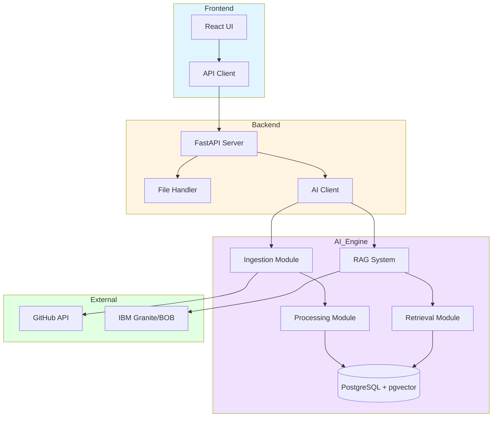

# Repository Intelligence Tool - Implementation Plan

## Project Overview
A comprehensive AI-powered tool that helps developers document their repositories and projects, making them easier to maintain. Uses IBM Granite/BOB for AI processing, FastAPI backend, React frontend, and PostgreSQL with pgvector for vector storage.

## Tech Stack
- **Frontend**: React 18+, Vite, Tailwind CSS
- **Backend**: FastAPI (Python 3.11+), Pydantic v2
- **AI Engine**: IBM Granite (embeddings + LLM), IBM BOB (reasoning)
- **Database**: PostgreSQL 15+ with pgvector extension
- **Infrastructure**: Docker, Docker Compose
- **Additional**: SQLAlchemy 2.0, Alembic (migrations)

---

## Phase 1: Project Foundation & Infrastructure Setup

### Objectives
- Set up project structure
- Configure development environment
- Establish Docker infrastructure
- Create shared utilities

### Tasks

#### 1.1 Project Structure Setup
- [ ] Create root directory structure
- [ ] Initialize Git repository with `.gitignore`
- [ ] Create `frontend/`, `backend/`, `ai_engine/`, `shared/` directories
- [ ] Set up `.env.example` with all required environment variables

#### 1.2 Docker Infrastructure
- [ ] Create `docker-compose.yml` with services:
  - PostgreSQL with pgvector
  - Backend API service
  - AI Engine service
  - Frontend dev server
- [ ] Create Dockerfiles for each service
- [ ] Configure volume mounts for development
- [ ] Set up networking between services

#### 1.3 Shared Utilities
- [ ] Create `shared/schemas.py` with Pydantic models:
  - `RepositoryMetadata`
  - `DocumentChunk`
  - `QueryRequest`
  - `QueryResponse`
  - `HealthScore`
- [ ] Create `shared/utils.py` with common functions:
  - File validation
  - URL validation
  - Error formatting

#### 1.4 Environment Configuration
- [ ] Document all required API keys (IBM Granite, IBM BOB)
- [ ] Set up environment variable validation
- [ ] Create configuration loading utilities

### Testing Criteria
- ✅ Docker Compose successfully starts all services
- ✅ PostgreSQL accessible with pgvector extension enabled
- ✅ All services can communicate via Docker network
- ✅ Environment variables load correctly

### Deliverables
- Working Docker development environment
- Project structure with all directories
- Shared schemas and utilities
- Environment configuration template

---

## Phase 2: Database Layer & Core Models

### Objectives
- Design database schema
- Implement SQLAlchemy models
- Set up migrations with Alembic
- Create CRUD operations

### Tasks

#### 2.1 Database Schema Design
- [ ] Design `repositories` table (id, url, name, metadata, created_at)
- [ ] Design `documents` table (id, repo_id, file_path, content, metadata)
- [ ] Design `chunks` table (id, doc_id, content, embedding, metadata)
- [ ] Design `queries` table (id, repo_id, query, response, citations)
- [ ] Add indexes for performance (repo_id, embeddings)

#### 2.2 SQLAlchemy Models (`ai_engine/database/models.py`)
- [ ] Create `Repository` model with relationships
- [ ] Create `Document` model with relationships
- [ ] Create `Chunk` model with vector column (pgvector)
- [ ] Create `Query` model for history tracking
- [ ] Add proper indexes and constraints

#### 2.3 Alembic Migrations
- [ ] Initialize Alembic in `ai_engine/`
- [ ] Create initial migration for all tables
- [ ] Add pgvector extension migration
- [ ] Test migration up/down

#### 2.4 CRUD Operations
- [ ] Implement `ai_engine/database/repositories.py`:
  - `create_repository()`
  - `get_repository()`
  - `list_repositories()`
  - `delete_repository()`
- [ ] Implement `ai_engine/database/documents.py`:
  - `create_document()`
  - `get_documents_by_repo()`
  - `delete_documents()`
- [ ] Implement `ai_engine/database/chunks.py`:
  - `create_chunk()`
  - `get_chunks_by_document()`
  - `vector_search()`
  - `hybrid_search()`

### Testing Criteria
- ✅ All migrations run successfully
- ✅ Tables created with correct schema
- ✅ pgvector extension working
- ✅ CRUD operations tested with sample data
- ✅ Vector similarity search returns results

### Deliverables
- Complete database schema
- SQLAlchemy models with relationships
- Alembic migrations
- Tested CRUD operations

---

## Phase 3: AI Engine - Ingestion Module

### Objectives
- Implement GitHub repository cloning
- Handle ZIP file uploads
- Process PDF documents
- Parse multiple file formats

### Tasks

#### 3.1 GitHub Ingestion (`ai_engine/ingestion/github_ingestion.py`)
- [ ] Implement `clone_repository(url)` using GitPython
- [ ] Add authentication for private repos
- [ ] Extract repository metadata (name, description, languages)
- [ ] Handle large repositories efficiently
- [ ] Implement cleanup after processing

#### 3.2 ZIP Handler (`ai_engine/ingestion/zip_handler.py`)
- [ ] Implement `extract_zip(file_path)` 
- [ ] Validate ZIP structure
- [ ] Handle nested directories
- [ ] Filter out binary/irrelevant files
- [ ] Extract to temporary directory

#### 3.3 PDF Processor (`ai_engine/ingestion/pdf_processor.py`)
- [ ] Implement `extract_text_from_pdf()` using PyPDF2/pdfplumber
- [ ] Handle multi-page PDFs
- [ ] Preserve document structure
- [ ] Extract metadata (title, author)

#### 3.4 File Parser (`ai_engine/ingestion/file_parser.py`)
- [ ] Implement parsers for:
  - Python (.py)
  - JavaScript/TypeScript (.js, .ts, .jsx, .tsx)
  - Java (.java)
  - Markdown (.md)
  - JSON/YAML (.json, .yaml)
  - HTML/CSS (.html, .css)
- [ ] Extract code structure (functions, classes)
- [ ] Handle encoding issues
- [ ] Skip binary files

#### 3.5 Ingestion Orchestrator
- [ ] Create main ingestion pipeline
- [ ] Coordinate file parsing
- [ ] Store documents in database
- [ ] Handle errors gracefully
- [ ] Provide progress tracking

### Testing Criteria
- ✅ Successfully clone public GitHub repository
- ✅ Extract and process ZIP files
- ✅ Parse PDF documents correctly
- ✅ Parse all supported code file types
- ✅ Documents stored in database with metadata
- ✅ Error handling works for invalid inputs

### Deliverables
- Working ingestion pipeline
- Support for GitHub, ZIP, and PDF
- Multi-language file parsing
- Database persistence

---

## Phase 4: AI Engine - Processing & Embeddings

### Objectives
- Implement semantic code chunking
- Generate embeddings using IBM Granite
- Perform code analysis with AST
- Extract repository metadata

### Tasks

#### 4.1 Semantic Chunker (`ai_engine/processing/chunker.py`)
- [ ] Implement `chunk_code()` with semantic awareness:
  - Respect function/class boundaries
  - Keep related code together
  - Target 500-1000 tokens per chunk
- [ ] Implement `chunk_markdown()` for documentation
- [ ] Add overlap between chunks (100 tokens)
- [ ] Preserve context in chunk metadata

#### 4.2 IBM Granite Embeddings (`ai_engine/processing/embeddings.py`)
- [ ] Set up IBM Granite embeddings client
- [ ] Implement `generate_embedding(text)` 
- [ ] Batch embedding generation for efficiency
- [ ] Handle API rate limits
- [ ] Cache embeddings to avoid recomputation
- [ ] Store embeddings in pgvector

#### 4.3 Code Analyzer (`ai_engine/processing/code_analyzer.py`)
- [ ] Implement AST parsing for Python using `ast` module
- [ ] Implement AST parsing for JavaScript using `esprima`
- [ ] Extract:
  - Function signatures
  - Class definitions
  - Import statements
  - Docstrings/comments
- [ ] Build code dependency graph
- [ ] Calculate complexity metrics

#### 4.4 Metadata Extractor (`ai_engine/processing/metadata_extractor.py`)
- [ ] Extract repository-level metadata:
  - Primary language
  - Framework detection (React, Django, etc.)
  - Dependencies from package files
  - README content
  - License information
- [ ] Extract file-level metadata:
  - File type
  - LOC (lines of code)
  - Last modified date
  - Author information (if available)

#### 4.5 Processing Pipeline
- [ ] Create orchestrator for processing workflow
- [ ] Chunk → Analyze → Embed → Store pipeline
- [ ] Parallel processing for multiple files
- [ ] Progress tracking and logging

### Testing Criteria
- ✅ Code chunked semantically (functions stay together)
- ✅ Embeddings generated successfully via IBM Granite
- ✅ Embeddings stored in pgvector
- ✅ AST analysis extracts correct code structure
- ✅ Metadata extracted accurately
- ✅ Processing pipeline handles 100+ files

### Deliverables
- Semantic chunking system
- IBM Granite embeddings integration
- Code analysis with AST
- Metadata extraction
- Complete processing pipeline

---

## Phase 5: AI Engine - Retrieval & RAG System

### Objectives
- Implement vector similarity search
- Build hybrid search (vector + keyword)
- Create context builder for RAG
- Integrate IBM Granite LLM and BOB reasoning

### Tasks

#### 5.1 Vector Search (`ai_engine/retrieval/vector_search.py`)
- [ ] Implement `similarity_search(query_embedding, top_k)` using pgvector
- [ ] Use cosine similarity for ranking
- [ ] Filter by repository ID
- [ ] Return chunks with similarity scores

#### 5.2 Hybrid Search (`ai_engine/retrieval/hybrid_search.py`)
- [ ] Implement keyword search using PostgreSQL full-text search
- [ ] Combine vector and keyword results with weighted scoring
- [ ] Implement re-ranking algorithm
- [ ] Add filters (file type, date range)

#### 5.3 Context Builder (`ai_engine/retrieval/context_builder.py`)
- [ ] Build hierarchical context from chunks:
  - File-level context
  - Function-level context
  - Related code context
- [ ] Add repository metadata to context
- [ ] Format context for LLM consumption
- [ ] Limit context to token budget (8K tokens)

#### 5.4 IBM Granite LLM Client (`ai_engine/rag/granite_client.py`)
- [ ] Set up IBM Granite LLM client
- [ ] Implement `generate_response(prompt, context)`
- [ ] Configure model parameters (temperature, max_tokens)
- [ ] Handle streaming responses
- [ ] Implement retry logic with exponential backoff

#### 5.5 IBM BOB Reasoning (`ai_engine/rag/bob_reasoning.py`)
- [ ] Integrate IBM BOB for advanced reasoning
- [ ] Implement multi-step reasoning for complex queries
- [ ] Add chain-of-thought prompting
- [ ] Validate reasoning steps

#### 5.6 Prompt Templates (`ai_engine/rag/prompt_templates.py`)
- [ ] Create templates for:
  - Code explanation
  - Documentation generation
  - Q&A responses
  - Health scoring
- [ ] Include system prompts with role definition
- [ ] Add few-shot examples

#### 5.7 Response Generator (`ai_engine/rag/response_generator.py`)
- [ ] Orchestrate RAG pipeline:
  1. Query → Embedding
  2. Retrieval → Context Building
  3. LLM Generation → Response
- [ ] Add source citations to responses
- [ ] Format responses with markdown
- [ ] Track token usage

### Testing Criteria
- ✅ Vector search returns relevant chunks
- ✅ Hybrid search improves results over vector-only
- ✅ Context builder creates coherent context
- ✅ IBM Granite generates accurate responses
- ✅ IBM BOB reasoning works for complex queries
- ✅ Citations link back to source code
- ✅ Response quality is high (manual review)

### Deliverables
- Vector and hybrid search
- Context building system
- IBM Granite LLM integration
- IBM BOB reasoning layer
- Complete RAG pipeline with citations

---

## Phase 6: Backend API Development

### Objectives
- Build FastAPI REST API
- Implement all endpoints
- Add middleware (CORS, error handling)
- Create API documentation

### Tasks

#### 6.1 FastAPI Setup (`backend/app/main.py`)
- [ ] Initialize FastAPI app
- [ ] Configure CORS middleware
- [ ] Add error handling middleware
- [ ] Set up logging
- [ ] Add health check endpoint

#### 6.2 Configuration (`backend/app/config.py`)
- [ ] Load environment variables
- [ ] Validate configuration
- [ ] Set up database connection string
- [ ] Configure AI engine connection

#### 6.3 Pydantic Models (`backend/app/models.py`)
- [ ] Create request/response models:
  - `RepositoryUploadRequest`
  - `QueryRequest`
  - `QueryResponse`
  - `DocumentationRequest`
  - `HealthScoreResponse`

#### 6.4 Ingestion Router (`backend/app/routers/ingestion.py`)
- [ ] `POST /api/ingest/github` - Ingest GitHub repository
- [ ] `POST /api/ingest/zip` - Upload and ingest ZIP file
- [ ] `POST /api/ingest/pdf` - Upload and ingest PDF
- [ ] `GET /api/ingest/status/{job_id}` - Check ingestion status
- [ ] Implement background tasks for long-running ingestion

#### 6.5 Query Router (`backend/app/routers/query.py`)
- [ ] `POST /api/query` - Ask questions about repository
- [ ] `GET /api/query/history/{repo_id}` - Get query history
- [ ] Stream responses for real-time feedback

#### 6.6 Documentation Router (`backend/app/routers/documentation.py`)
- [ ] `POST /api/docs/generate/{repo_id}` - Generate documentation
- [ ] `GET /api/docs/{repo_id}` - Get generated documentation
- [ ] `GET /api/docs/templates` - List available templates

#### 6.7 Health Router (`backend/app/routers/health.py`)
- [ ] `GET /api/health/score/{repo_id}` - Get documentation health score
- [ ] `GET /api/health/metrics/{repo_id}` - Get detailed metrics

#### 6.8 Services Layer
- [ ] `backend/app/services/file_handler.py` - Handle file uploads
- [ ] `backend/app/services/ai_client.py` - Communicate with AI engine

#### 6.9 Middleware
- [ ] `backend/app/middleware/cors.py` - CORS configuration
- [ ] `backend/app/middleware/error_handler.py` - Global error handling

### Testing Criteria
- ✅ All endpoints return correct status codes
- ✅ Request validation works (Pydantic)
- ✅ File uploads handled correctly
- ✅ Background tasks execute successfully
- ✅ Error responses formatted properly
- ✅ API documentation auto-generated (Swagger)
- ✅ CORS configured for frontend

### Deliverables
- Complete FastAPI backend
- All API endpoints implemented
- Request/response validation
- Error handling and logging
- API documentation

---

## Phase 7: Frontend Core Components

### Objectives
- Set up React + Vite project
- Implement core UI components
- Create API client
- Build basic user flows

### Tasks

#### 7.1 Project Setup
- [ ] Initialize Vite + React project
- [ ] Configure Tailwind CSS
- [ ] Set up React Router
- [ ] Configure environment variables
- [ ] Add ESLint and Prettier

#### 7.2 API Client (`frontend/src/services/api.js`)
- [ ] Create Axios instance with base URL
- [ ] Implement API methods:
  - `ingestGithub(url)`
  - `uploadZip(file)`
  - `uploadPdf(file)`
  - `queryRepository(repoId, query)`
  - `getDocumentation(repoId)`
  - `getHealthScore(repoId)`
- [ ] Add request/response interceptors
- [ ] Handle errors globally

#### 7.3 Repository Input Component (`frontend/src/components/RepositoryInput.jsx`)
- [ ] Create tabbed interface for:
  - GitHub URL input
  - ZIP file upload
  - PDF file upload
- [ ] Add input validation
- [ ] Show upload progress
- [ ] Display success/error messages
- [ ] Trigger ingestion on submit

#### 7.4 Question Interface Component (`frontend/src/components/QuestionInterface.jsx`)
- [ ] Create chat-like interface
- [ ] Input field for questions
- [ ] Display query history
- [ ] Show loading state during query
- [ ] Stream responses in real-time
- [ ] Display citations inline

#### 7.5 Documentation Viewer Component (`frontend/src/components/DocumentationViewer.jsx`)
- [ ] Render markdown documentation
- [ ] Add syntax highlighting for code blocks
- [ ] Create table of contents
- [ ] Add search within documentation
- [ ] Export documentation (PDF, Markdown)

#### 7.6 Custom Hooks
- [ ] `frontend/src/hooks/useRepository.js`:
  - Manage repository state
  - Handle ingestion status
  - Cache repository data
- [ ] `frontend/src/hooks/useQuery.js`:
  - Manage query state
  - Handle streaming responses
  - Store query history

#### 7.7 Main App Component (`frontend/src/App.jsx`)
- [ ] Set up routing
- [ ] Create main layout
- [ ] Add navigation
- [ ] Implement repository selection
- [ ] Add loading states

### Testing Criteria
- ✅ GitHub URL ingestion works end-to-end
- ✅ File uploads (ZIP, PDF) work correctly
- ✅ Questions return accurate responses
- ✅ Documentation renders properly
- ✅ UI is responsive on mobile/desktop
- ✅ Error states display correctly
- ✅ Loading states provide feedback

### Deliverables
- Working React frontend
- Core UI components
- API integration
- Basic user flows functional

---

## Phase 8: Frontend Advanced Features

### Objectives
- Implement health dashboard
- Add source citations display
- Enhance UX with animations
- Add advanced features

### Tasks

#### 8.1 Health Dashboard Component (`frontend/src/components/HealthDashboard.jsx`)
- [ ] Display overall health score (0-100)
- [ ] Show metrics breakdown:
  - Documentation coverage
  - Code complexity
  - Comment density
  - README quality
- [ ] Visualize metrics with charts (Chart.js or Recharts)
- [ ] Add recommendations for improvement
- [ ] Show trend over time (if multiple scans)

#### 8.2 Source Citations Component (`frontend/src/components/SourceCitations.jsx`)
- [ ] Display cited code snippets
- [ ] Link to original file/line number
- [ ] Syntax highlighting for code
- [ ] Expand/collapse citations
- [ ] Copy code to clipboard

#### 8.3 Advanced Features
- [ ] Add dark mode toggle
- [ ] Implement keyboard shortcuts
- [ ] Add search across all repositories
- [ ] Create repository comparison view
- [ ] Add export functionality (JSON, CSV)

#### 8.4 UX Enhancements
- [ ] Add loading skeletons
- [ ] Implement smooth transitions
- [ ] Add toast notifications
- [ ] Improve error messages
- [ ] Add tooltips for complex features

#### 8.5 Performance Optimization
- [ ] Implement code splitting
- [ ] Lazy load components
- [ ] Optimize bundle size
- [ ] Add service worker for caching
- [ ] Implement virtual scrolling for long lists

### Testing Criteria
- ✅ Health dashboard displays accurate metrics
- ✅ Citations link to correct source code
- ✅ Dark mode works across all components
- ✅ Performance is smooth (60fps)
- ✅ Bundle size is optimized (<500KB)
- ✅ Accessibility standards met (WCAG 2.1)

### Deliverables
- Health dashboard with visualizations
- Source citations display
- Dark mode support
- Performance optimizations
- Enhanced UX

---

## Phase 9: Integration Testing & Documentation

### Objectives
- End-to-end testing
- Write comprehensive documentation
- Create demo content
- Performance testing

### Tasks

#### 9.1 Integration Testing
- [ ] Test complete flow: GitHub → Ingestion → Query → Response
- [ ] Test ZIP upload flow
- [ ] Test PDF upload flow
- [ ] Test error scenarios (invalid URL, large files)
- [ ] Test concurrent users
- [ ] Load test with multiple repositories

#### 9.2 Unit Testing
- [ ] Backend: Test all API endpoints
- [ ] Backend: Test database operations
- [ ] AI Engine: Test chunking algorithm
- [ ] AI Engine: Test embedding generation
- [ ] AI Engine: Test RAG pipeline
- [ ] Frontend: Test components with React Testing Library

#### 9.3 Documentation
- [ ] Write comprehensive README.md:
  - Project overview
  - Architecture diagram
  - Setup instructions
  - Usage examples
- [ ] Create API documentation (OpenAPI/Swagger)
- [ ] Write developer guide:
  - Code structure
  - Adding new features
  - Troubleshooting
- [ ] Create user guide with screenshots
- [ ] Document environment variables

#### 9.4 Demo Content
- [ ] Create demo video showing key features
- [ ] Prepare sample repositories for testing
- [ ] Create presentation slides

#### 9.5 Performance Testing
- [ ] Measure ingestion time for various repo sizes
- [ ] Measure query response time
- [ ] Test embedding generation speed
- [ ] Optimize bottlenecks

### Testing Criteria
- ✅ All integration tests pass
- ✅ Unit test coverage >80%
- ✅ Documentation is clear and complete
- ✅ Demo successfully showcases features
- ✅ Performance meets targets:
  - Query response <3 seconds
  - Ingestion <5 minutes for medium repo
  - Embedding generation <1 second per chunk

### Deliverables
- Complete test suite
- Comprehensive documentation
- Demo materials
- Performance benchmarks

---

## Phase 10: Deployment & Production Readiness

### Objectives
- Prepare for production deployment
- Set up CI/CD pipeline
- Configure monitoring
- Security hardening

### Tasks

#### 10.1 Production Configuration
- [ ] Create production Docker Compose file
- [ ] Set up environment-specific configs
- [ ] Configure production database
- [ ] Set up Redis for caching (optional)
- [ ] Configure CDN for frontend assets

#### 10.2 CI/CD Pipeline
- [ ] Set up GitHub Actions:
  - Run tests on PR
  - Build Docker images
  - Deploy to staging
  - Deploy to production
- [ ] Add automated security scanning
- [ ] Add dependency vulnerability checks

#### 10.3 Monitoring & Logging
- [ ] Set up application logging (structured logs)
- [ ] Configure error tracking (Sentry or similar)
- [ ] Add performance monitoring (APM)
- [ ] Set up uptime monitoring
- [ ] Create alerting rules

#### 10.4 Security Hardening
- [ ] Implement rate limiting
- [ ] Add API authentication (JWT)
- [ ] Secure environment variables
- [ ] Enable HTTPS
- [ ] Add input sanitization
- [ ] Implement CSRF protection
- [ ] Add security headers

#### 10.5 Backup & Recovery
- [ ] Set up automated database backups
- [ ] Test backup restoration
- [ ] Document disaster recovery plan
- [ ] Set up data retention policies

#### 10.6 Scaling Preparation
- [ ] Configure horizontal scaling for backend
- [ ] Set up load balancer
- [ ] Optimize database queries
- [ ] Add database connection pooling
- [ ] Configure caching strategy

### Testing Criteria
- ✅ Application deploys successfully to production
- ✅ CI/CD pipeline runs without errors
- ✅ Monitoring captures errors and metrics
- ✅ Security scan passes
- ✅ Backup and restore works
- ✅ Application handles expected load

### Deliverables
- Production-ready deployment
- CI/CD pipeline
- Monitoring and alerting
- Security hardening
- Backup strategy

---

## Development Workflow

### Daily Workflow
1. **Start Development Environment**
   ```bash
   docker-compose up -d
   ```

2. **Work on Current Phase**
   - Follow task checklist
   - Write tests alongside code
   - Commit frequently with clear messages

3. **Test Changes**
   - Run unit tests
   - Test in browser/API client
   - Verify Docker services

4. **End of Day**
   - Push changes to Git
   - Update progress in plan
   - Document any blockers

### Phase Completion Checklist
Before moving to next phase:
- [ ] All tasks completed
- [ ] Tests passing
- [ ] Code reviewed
- [ ] Documentation updated
- [ ] Demo prepared for stakeholder review

### Git Workflow
- **Main branch**: Production-ready code
- **Develop branch**: Integration branch
- **Feature branches**: `feature/phase-X-task-name`
- **Commit format**: `[Phase X] Task description`

---

## Architecture Diagram



---

## Risk Management

### Potential Risks & Mitigations

1. **IBM API Rate Limits**
   - Risk: Hitting rate limits during development
   - Mitigation: Implement caching, batch requests, add retry logic

2. **Large Repository Processing**
   - Risk: Timeout or memory issues with huge repos
   - Mitigation: Implement streaming, chunked processing, file filtering

3. **Embedding Storage Costs**
   - Risk: Database size grows quickly
   - Mitigation: Implement cleanup policies, compress embeddings

4. **Response Quality**
   - Risk: LLM generates inaccurate responses
   - Mitigation: Extensive prompt engineering, add validation, user feedback loop

5. **Performance Bottlenecks**
   - Risk: Slow query responses
   - Mitigation: Optimize vector search, add caching, implement pagination

---

## Success Metrics

### Technical Metrics
- Query response time: <3 seconds (p95)
- Ingestion time: <5 minutes for 1000 files
- Embedding accuracy: >0.85 similarity for relevant chunks
- API uptime: >99.5%
- Test coverage: >80%

### User Experience Metrics
- Time to first query: <2 minutes (from URL input)
- Documentation quality score: >80/100
- User satisfaction: >4/5 stars

### Business Metrics
- Repositories processed: Track growth
- Active users: Track engagement
- Query volume: Track usage patterns

---

## Next Steps

1. **Review this plan** - Ensure all requirements are covered
2. **Set up development environment** - Start with Phase 1
3. **Begin implementation** - Work through phases sequentially
4. **Regular check-ins** - Review progress after each phase
5. **Iterate and improve** - Adjust plan based on learnings

---

## Notes

- Each phase builds on the previous one - don't skip ahead
- Test thoroughly at each phase before moving forward
- Document decisions and learnings as you go
- Keep the plan updated as requirements evolve
- Celebrate milestones! 🎉
